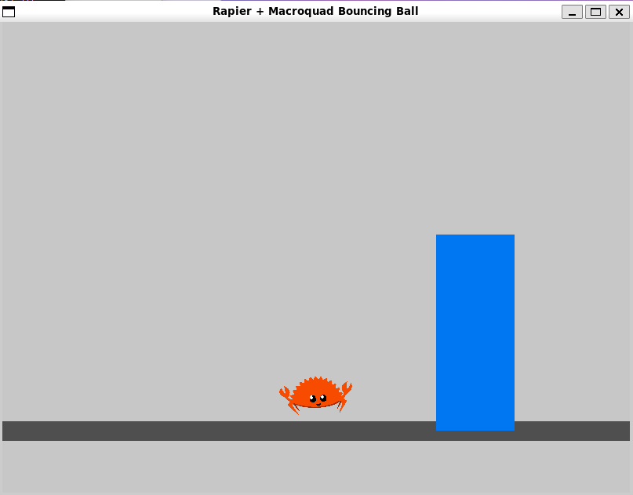

# Ferris Jumping Game

[](#)
[](#)
[](#)
[](https://yakisobites.github.io/jumping_game/)

## 🎮 Overview

**Ferris Jumping Game** は、Rust 製の軽快なゲームループに、**Rapier2D** の物理演算と **Macroquad** の描画を組み合わせて作られた、シンプルながら動かして楽しいゲームプロジェクトです。  
プレイヤーは Ferris を操作し、物理挙動を活かしながらバランスよく浮かび続け、高スコアを目指します。Rust でゲーム開発を楽しみたい人にとって、実装の見通しと遊び心の両方を味わえる構成になっています。



## ✨ Features

- Rapier2D による**リアルタイム物理演算**で、慣性や反発を感じられる挙動
- Macroquad による**シンプルで軽快な描画・入力処理**
- Ferris を操作して生き残る、**スコアアタック型のゲーム性**
- タイトル画面、プレイ中、ゲームオーバーを備えた**分かりやすいゲームフロー**
- 今後の発展先として、障害物追加・演出強化・ステージ拡張なども楽しめる構成

## 📦 使用ライブラリ

- [rapier2d](https://github.com/dimforge/rapier) - 2D物理エンジン
- [macroquad](https://github.com/not-fl3/macroquad) - ゲーム描画・入力ライブラリ

## 🕹️ 操作方法

- `Enter`：ゲーム開始
- `↑`：上昇
- `←`：左に移動
- `→`：右に移動
- `R`：リスタート
- `ESC`：タイトルへ戻る / 終了

## 🚀 Getting Started

Rust の開発環境があれば、以下の手順でローカル実行できます。

```bash
git clone https://github.com/Yakisobites/jumping_game.git
cd jumping_game
cargo run --release
```

## 🌐 GitHub Pagesで遊ぶ

このプロジェクトは GitHub Actions による自動デプロイに対応しており、`main` ブランチへの反映後に GitHub Pages へ公開されます。  
ブラウザですぐにプレイしたい場合は、こちらからアクセスできます。

- 🎯 Play Now: https://yakisobites.github.io/jumping_game/

## 🛠️ 開発メモ

- Rust 2024 Edition を使用
- `cargo run --release` で最適化ビルドを実行
- Rapier2D と Macroquad を組み合わせた、学習にも発展にも向いた小規模ゲームプロジェクト
